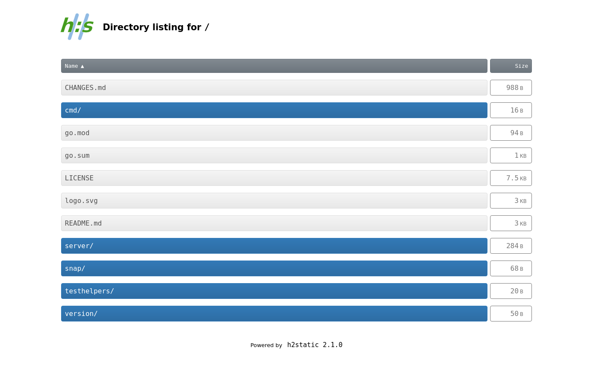
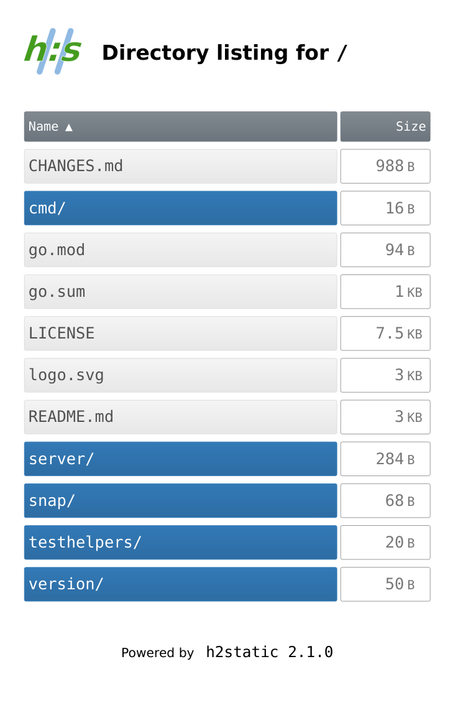

# Tiny static web server with TLS and HTTP/2 support

[](https://github.com/albertodonato/h2static/actions?query=workflow%3ACI)
[](https://goreportcard.com/report/github.com/albertodonato/h2static)
[](https://snapcraft.io/h2static)


A minimal HTTP server for serving static files (and websites).

It provides a few handy features for serving files and static websites:

* support for HTTP/2
* support for TLS (HTTPS)
* support for HTTP Basic Authentication
* directory listing in HTML and JSON format
* serve `index.html`/`index.htm` files for the contaning directory
* serve the corresponding `.html`/`.htm` file for a path without the suffix
  (when such path doesn't exist)
  

HTML directory listing provides a responsive design to support both desktop

<p align="center"></p>

and mobile

<p align="center"></p>


## Install

Pre-built binaries are available for different achitectures on the [releases
page](https://github.com/albertodonato/h2static/releases).

It can be installed directly via

```bash
go install github.com/albertodonato/h2static/cmd/h2static@latest
```

Alternatively, it can be run from the repository simply as

```bash
go run ./cmd/h2static
```

and built with

```bash
go build ./cmd/h2static
```

which produces a `h2static` binary.


## HTTPS support

To run the server on HTTPS, a key/certificate pair in PEM format is
required. The service can be run with

```bash
h2static -tls-cert cert.pem -tls-key key.pem
```


## JSON directory listing

When requesting a path that matches a directory, it's possible to get the
listing in JSON format by setting the `Accept` header to `application/json` in
the request:

```
$ curl -s -H "Accept: application/json" http://localhost:8080/ | jq
{
  "Name": "/",
  "IsRoot": true,
  "Entries": [
    {
      "Name": "bar.txt",
      "IsDir": false,
      "Size": 11
    },
    {
      "Name": "foo.txt",
      "IsDir": false,
      "Size": 6
    },
    {
      "Name": "subdir",
      "IsDir": true,
      "Size": 0
    }
  ]
}
```


## Basic-authentication


It's possible to enable Basic-authentication for the static serve via the `--basic-auth authfile` option. The `authfile` should have the following format:


```
user1:bc547750b92797f955b36112cc9bdd5cddf7d0862151d03a167ada8995aa24a9ad24610b36a68bc02da24141ee51670aea13ed6469099a4453f335cb239db5da
user2:92a891f888e79d1c2e8b82663c0f37cc6d61466c508ec62b8132588afe354712b20bb75429aa20aa3ab7cfcc58836c734306b43efd368080a2250831bf7f363f
```

where passwords are SHA-512 hashed. A simple way to generate the hash is via:

```bash
echo -n PASSWORD | sha512sum
911b0a07a8cacfebc5f1f45596d67017136c950499fa5b4ff6faffa031f3cec7f197853d1660712c154e1f59c60f682e34ea9b5cbd2d8d5adb0c834f963f30de  -
```

and copying the resulting hash to the file.


Note that the password file is read once at startup, subsequent changes to it won't affect authentication.


## Usage

Full usage options are as follows:

```
Usage of h2static:

  -addr string
        address and port to listen on (default ":8080")
  -allow-outside-symlinks
        allow symlinks with target outside of directory
  -basic-auth string
        password file for Basic Auth (each line should be in the form "user:SHA512-hash")
  -css string
        file to override builtin CSS for listing
  -debug-addr string
        address and port to serve /debug URLs on
  -dir string
        directory to serve (default ".")
  -disable-h2
        disable HTTP/2 support
  -disable-index
        disable directory index
  -disable-lookup-with-suffix
        disable matching files with .htm(l) suffix for paths without suffix
  -log
        log requests
  -request-path-prefix string
        prefix to strip from request path (e.g. when behind a reverse proxy)
  -show-dotfiles
        show files whose name starts with a dot
  -tls-cert string
        certificate file for TLS connections
  -tls-key string
        key file for TLS connections
  -version
        print program version and exit
```


## Install from Snap

The tool can be installed from the [Snap Store](https://snapcraft.io), on
systems where Snaps are supported, via

```bash
sudo snap install h2static
```

The `h2static` binary should be available in path.

It's also possible to configure the service in the snap so that it run
automatically.  See `snap info h2static` for details about the available snap
settings.

[](https://snapcraft.io/h2static)


### Snap setup with Let's Encrypt certificates

Assuming [Certbot](https://certbot.eff.org/) is already set up to handle
certificate renewals for the domain, a simple hook can be added to update
certificates for `h2static`.  The hook could be written to
`/etc/letsencrypt/renewal-hooks/post/h2static` with the following content:


```bash
#!/bin/bash

DOMAIN="example.com"
CERTSDIR="/etc/letsencrypt/live/$DOMAIN"

snap set h2static tls.cert="$(<$CERTSDIR/fullchain.pem)" tls.key="$(<$CERTSDIR/privkey.pem)"
```
